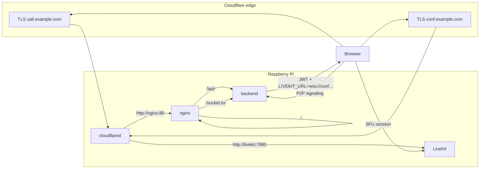

# Raspberry Pi 5 (Ubuntu): Docker deployment behind Cloudflare Tunnel

**Placeholders:** This document uses **`example.com`**, **`call.example.com`**, and **`conf.example.com`** as generic examples ([RFC 2606](https://datatracker.ietf.org/doc/html/rfc2606)). Substitute your own domain (e.g. `call.yourdomain.com` / `conf.yourdomain.com`) in DNS, tunnel routes, and env files.

This guide explains how to run E-Call on a Raspberry Pi 5 with Ubuntu, using **Docker Compose** (with automatic restart), with **two subdomains**:

| Subdomain | Role |
|-----------|------|
| **`call.example.com`** | Web app (SPA), REST API, and **Socket.io** — used for **1:1 P2P** signaling and all room/join flows. |
| **`conf.example.com`** | **LiveKit** only — WebSocket + HTTP for **conferences (3+)** / SFU mode. |

**`example.com`** (apex) can stay on your main site or other services.

Traffic reaches the Pi through a **Cloudflare Tunnel** (no need to expose port 443 on your router for HTTPS to these hostnames).

---

## 1. Is this configuration possible?

**Yes, with clear boundaries.**

| Piece | Feasibility | Notes |
|--------|-------------|--------|
| **`call.example.com`** | Yes | DNS + tunnel → **nginx** → static UI + **Express** (`/api/`) + **Socket.io** (`/socket.io/`). |
| **`conf.example.com`** | Yes | DNS + tunnel → **LiveKit** (e.g. container port **7880**). Use this **only** for SFU traffic the LiveKit client expects. |
| **Docker + auto-restart** | Yes | `restart: unless-stopped` on **cloudflared**, **nginx**, **backend**, and **livekit**. |
| **SPA at site root on `call`** | Yes | Matches this repo: default Vite base and React Router (no extra `basename`). |
| **P2P WebRTC** | Via `call` for signaling | **Media** is peer-to-peer; it does **not** flow through Cloudflare. Plan **STUN/TURN** as usual. |
| **Conference (3+) WebRTC** | Via `conf` + LiveKit | Browser talks to **`wss://conf.example.com`** for LiveKit signaling. **UDP/WebRTC media** to your own LiveKit still needs a **reachable host/port range** (often **UDP + TCP** forwarded to the Pi, or **TURN**, or **LiveKit Cloud**). The tunnel helps the **wss** control plane; it does not replace RTC connectivity. |

**Why split `call` vs `conf`?**

- **Clear product split:** P2P = everything on **`call`**; conferences = app UI still on **`call`**, but the client connects the SFU at **`conf`** using `LIVEKIT_URL` / tokens from your API.
- **Independent scaling and config:** You can restart, upgrade, or move LiveKit without touching the nginx stack for `call`.
- **Certificates and tunnel rules:** Two public hostnames map to two upstreams (`nginx` vs `livekit`) with no path tricks.
- **Security posture:** You can apply different Cloudflare policies (access, rate limits) per hostname if needed.

---

## 2. Why subdomains instead of `example.com/call`?

| Approach | Pros | Cons |
|----------|------|------|
| **`call.*` + `conf.*` (recommended)** | Simple paths on each host; P2P vs SFU endpoints are obvious; LiveKit keeps its own origin. | Two DNS names + two tunnel routes. |
| **`example.com/call`** | Single marketing hostname. | Requires `base`/`basename` and careful **Socket.io** proxying; LiveKit under a path is still awkward. |

---

## 3. High-level architecture



- **`call`:** UI loads here; **join-token** and room APIs run here; **P2P** uses Socket.io on this host.
- **`conf`:** LiveKit server; the **frontend** (still opened from `call`) uses the LiveKit SDK against **`wss://conf.example.com`** (or `wss://conf.example.com/…` per your LiveKit version — match `livekit.yaml` and docs).

---

## 4. DNS and Cloudflare Tunnel

### 4.1 DNS

In the Cloudflare dashboard for **`example.com`**:

- **`call`** — CNAME / tunnel hostname for the **app** stack (nginx).
- **`conf`** — CNAME / tunnel hostname for **LiveKit** (conferences).

Cloudflare often creates these automatically when you add **Public hostnames** in Zero Trust; otherwise create records that point at the tunnel as documented for your setup.

### 4.2 Tunnel ingress (two hostnames)

Example **`config.yml`** fragment (same Docker network for `cloudflared`, `nginx`, `livekit`):

```yaml
tunnel: YOUR_TUNNEL_ID
credentials-file: /etc/cloudflared/YOUR_TUNNEL_ID.json

ingress:
  - hostname: call.example.com
    service: http://nginx:80

  - hostname: conf.example.com
    service: http://livekit:7880

  # Other hostnames…

  - service: http_status:404
```

In the **Zero Trust** UI, add two routes:

1. `call.example.com` → `http://nginx:80`
2. `conf.example.com` → `http://livekit:7880`

**WebSockets:** Required for Socket.io on **`call`** and for LiveKit on **`conf`**; Cloudflare Tunnel supports them.

**RTC UDP:** LiveKit’s **media ports** (see `infra/livekit.yaml` `rtc` range) are **not** carried as generic UDP over a normal HTTP tunnel. For home/Pi deployments you typically **forward UDP (and TCP RTC)** from your router to the Pi, configure **`use_external_ip`** / **STUN**, and/or use **LiveKit’s TURN** on **443** with proper DNS. Treat **`conf.example.com`** as the **signaling/WebSocket** front door; plan **UDP** separately or use **LiveKit Cloud** if you want to avoid opening ports.

---

## 5. Docker Compose on the Pi (auto-restart)

Principles:

- **`restart: unless-stopped`** on **cloudflared**, **nginx**, **backend**, and **livekit**.
- **Internal Docker network**; cloudflared reaches **nginx** and **livekit** by service name.
- **ARM64** images on Pi 5.

### 5.1 Example layout (conceptual)

```yaml
services:
  cloudflared:
    image: cloudflare/cloudflared:latest
    restart: unless-stopped
    command: tunnel --no-autoupdate run
    environment:
      - TUNNEL_TOKEN=${TUNNEL_TOKEN}
    networks: [ecall]

  nginx:
    image: nginx:alpine
    restart: unless-stopped
    env_file: .env
    volumes:
      # P2P repo: templates/default.conf.template + docker-entrypoint.d (server_name from APP_BASE_URL)
      - ./nginx/templates/default.conf.template:/etc/nginx/templates/default.conf.template:ro
      - ./nginx/docker-entrypoint.d/05-compute-call-host.sh:/docker-entrypoint.d/05-compute-call-host.sh:ro
      - ./frontend-dist:/usr/share/nginx/html:ro
    depends_on: [backend]
    networks: [ecall]

  backend:
    build: ./backend
    restart: unless-stopped
    environment:
      PORT: "3001"
      NODE_ENV: production
      CORS_ORIGIN: "https://call.example.com"
      APP_BASE_URL: "https://call.example.com"
      ROOM_TTL_MINUTES: "1440"
      LIVEKIT_URL: "wss://conf.example.com"
      LIVEKIT_API_KEY: "${LIVEKIT_API_KEY}"
      LIVEKIT_API_SECRET: "${LIVEKIT_API_SECRET}"
    networks: [ecall]

  livekit:
    image: livekit/livekit-server:latest
    restart: unless-stopped
    command: --config /etc/livekit.yaml
    volumes:
      - ./livekit.yaml:/etc/livekit.yaml:ro
    networks: [ecall]
    # Alternative on Pi: network_mode: host (omit `networks:`) and set tunnel to http://127.0.0.1:7880 — see LiveKit Docker docs for RTC/UDP.

networks:
  ecall:
    driver: bridge
```

**Note:** **`network_mode: host`** simplifies RTC on Linux but you **cannot** use `networks:` with it; then **cloudflared** must reach LiveKit via **`http://127.0.0.1:7880`** (or the host’s LAN IP) instead of `http://livekit:7880`. With **bridge** networking (as above), `conf.example.com` → `http://livekit:7880` works inside Compose; you still must publish/map **UDP RTC** per LiveKit. Pick one model and align tunnel + firewall; this doc is not a full LiveKit networking guide.

- **Frontend:** build `frontend/` and copy **`dist/*`** into **`frontend-dist/`** for nginx.
- **Backend:** image runs `node dist/index.js`.

### 5.2 nginx for `call.*` only

LiveKit is **not** proxied through this nginx; browsers reach **`conf.*`** via its own tunnel route.

The **P2P** deployment in this repo uses **`infra/pi/nginx/templates/default.conf.template`**: at container start, a hook sets **`CALL_HOST`** from **`APP_BASE_URL`**, then the official nginx image runs **`envsubst`** (so you do not duplicate the hostname in a second file). See **`infra/pi/nginx/README.md`** and **[deploy-pi-p2p.md](./deploy-pi-p2p.md)**.

**Forwarded HTTPS:** Behind Cloudflare Tunnel, the generated config sets **`X-Forwarded-Proto: https`** to the backend.

---

## 6. Environment variables (production)

| Variable | Example | Purpose |
|----------|---------|---------|
| `CORS_ORIGIN` | `https://call.example.com` | Browser origin for the API (SPA is on **`call`**). |
| `APP_BASE_URL` | `https://call.example.com` | Invite links (`POST /api/rooms`). |
| `VITE_API_BASE_URL` | `https://call.example.com` | Frontend API + Socket.io (build-time). |
| `LIVEKIT_URL` | `wss://conf.example.com` | Returned in **join-token** for **SFU** rooms; LiveKit client connects here. |
| `LIVEKIT_API_KEY` / `LIVEKIT_API_SECRET` | from `livekit.yaml` `keys` | Minting access tokens on the backend. |

**`livekit.yaml`** should list the same API key/secret and set **`domain`** / TURN to match **`conf.example.com`** where LiveKit expects it (see [LiveKit deployment docs](https://docs.livekit.io/)).

---

## 7. Operational checklist

1. **DNS:** **`call`** and **`conf`** point at the tunnel (or auto-managed records).
2. **Tunnel:** Routes for **`call.example.com`** → nginx, **`conf.example.com`** → LiveKit HTTP port.
3. **LiveKit:** Config keys match backend env; **RTC ports** and **UDP** path verified for real clients.
4. **Deploy:** Frontend on nginx; Compose up; logs clean.
5. **Smoke tests:**  
   - P2P: two tabs on **`https://call.example.com`**, 1:1 room.  
   - Conference: create **SFU** room (when the app exposes it), join-token returns **`wss://conf.example.com`**, 3+ participants.

---

## 8. Relation to the rest of this repo

- `infra/livekit.yaml` — align **`keys`** and **`turn.domain`** (or similar) with **`conf.example.com`** when you enable TURN on 443.
- `infra/nginx.conf` — generic example; production under tunnel uses the **`call`-only** nginx pattern above.
- Room **mode** in the API: **`p2p`** uses **`call`** only; **`sfu`** uses **`call`** for API + **`conf`** for media.

---

## 9. Summary

| Question | Answer |
|----------|--------|
| Split **P2P** vs **3+ conf** by endpoint? | **Yes — recommended:** **`call.example.com`** (app + P2P signaling), **`conf.example.com`** (LiveKit). |
| Pi 5 + Docker + auto-restart? | Yes — `restart: unless-stopped` on each service. |
| Caveats? | Tunnel carries **HTTPS/WSS**; **UDP RTC** for self-hosted LiveKit still needs correct **ports/NAT/TURN**. |

**P2P Docker deployment** (this repo): **`infra/pi/docker-compose.p2p.yml`**, **`infra/pi/nginx/`** (templated config from **`APP_BASE_URL`**), and **[deploy-pi-p2p.md](./deploy-pi-p2p.md)**.

**Conferences (LiveKit)** on **`conf.example.com`**: add a LiveKit service and tunnel route; align **`livekit.yaml`** keys with backend **`LIVEKIT_*`** (see sections above).
